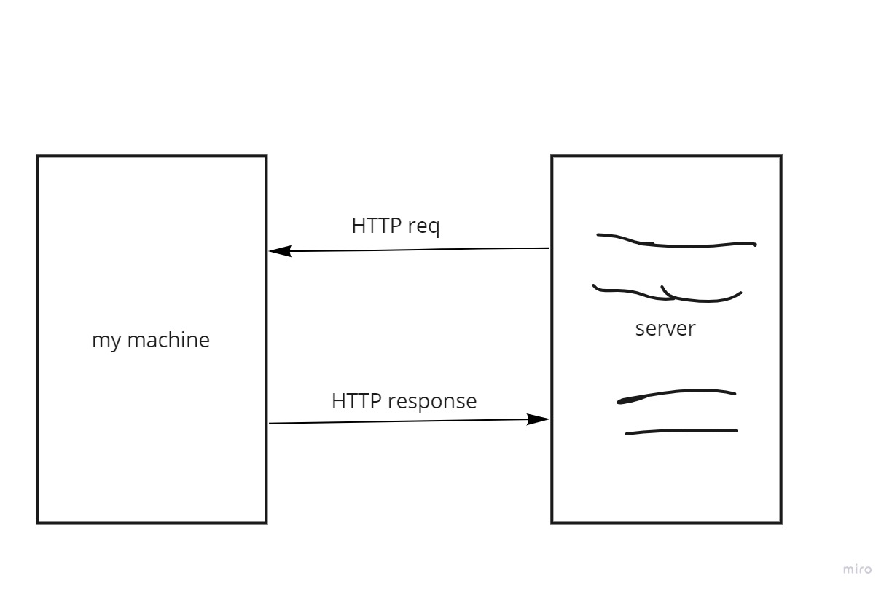

#

# Project Name - Movies-Library

**Yahia Khalil**

## WRRC

## Overview

## Getting Started

1. We created an endpoint with a variable name (id)(/path/:id)
2. We created the Handler
3. We got the id from req.params.id
4. We add the SELECT statement from the database based on the id.
5. We returned the result.rows
6. We created an endpoint with a variable name (id)(/path/:id)
7. We created our Handler
8. We got the id from req.params.id
9. We got the new data from req.body
10. We did the UPDATE statement for the database and we retune the updated
11. We returned to the client the updated data with status 200
12. We created an endpoint with a variable name (id)(/path/:id)
13. We created our Handler
14. We got the id from req.params.id
15. We did the DELETE statement fro the database
16. We return a response with status of 204 and an empty object.

## Project Features

<!-- What are the features included in you app -->
